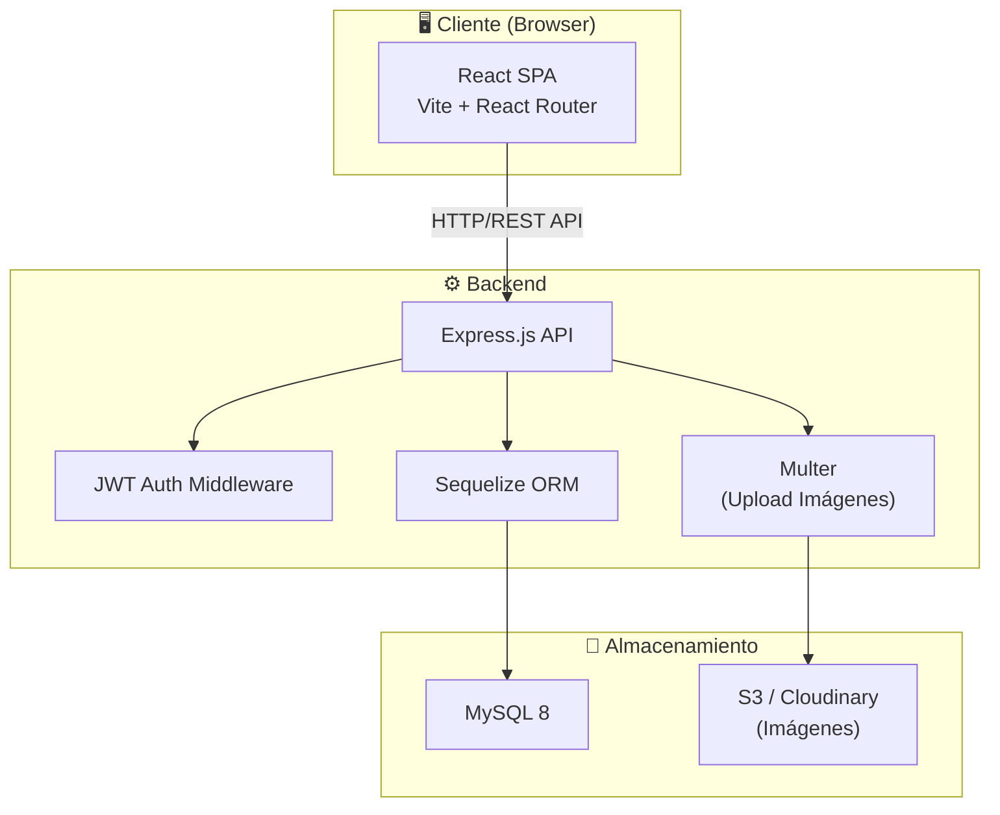
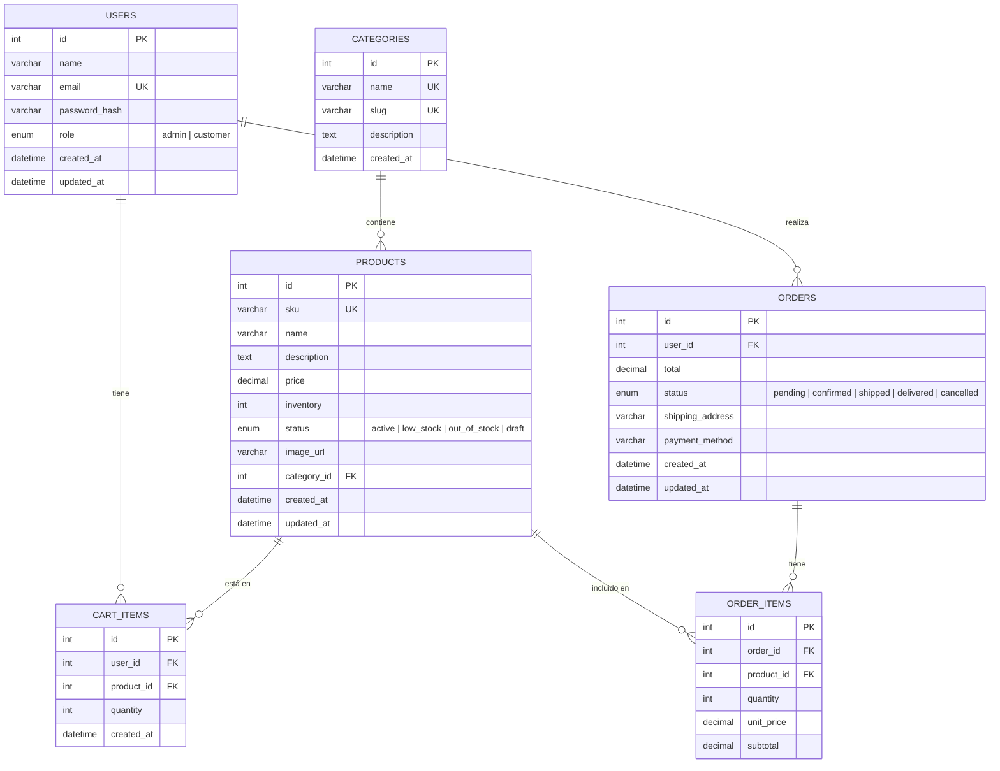
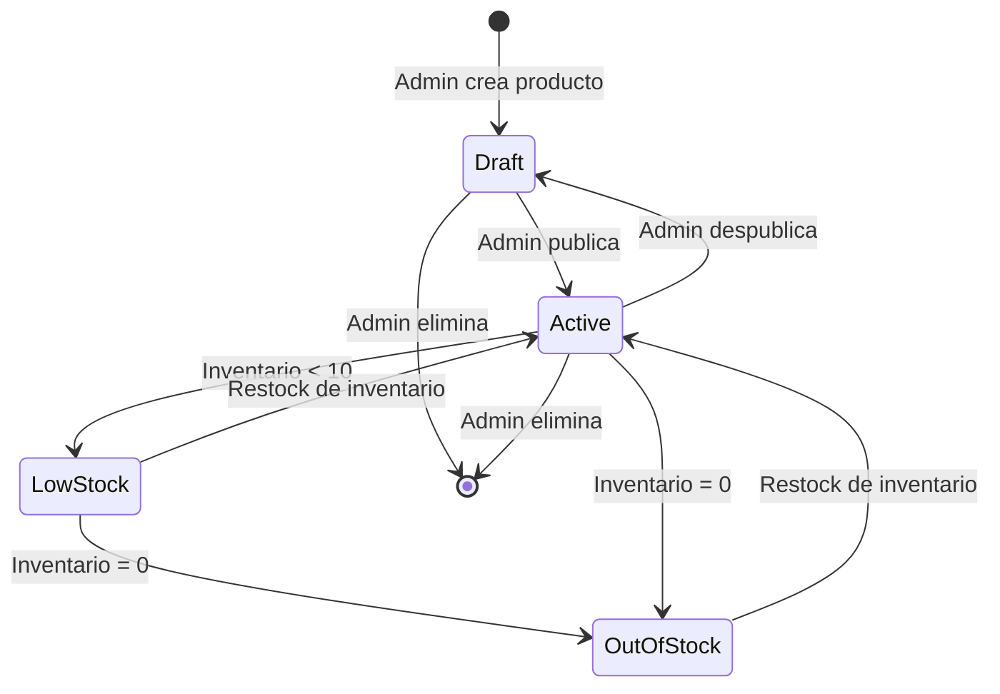
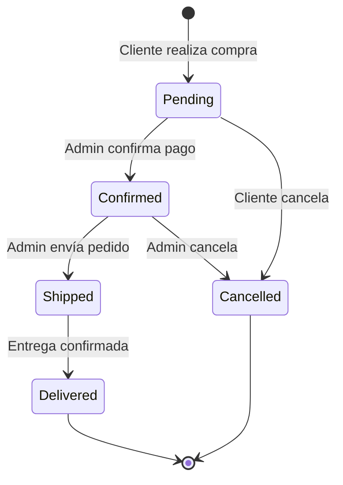
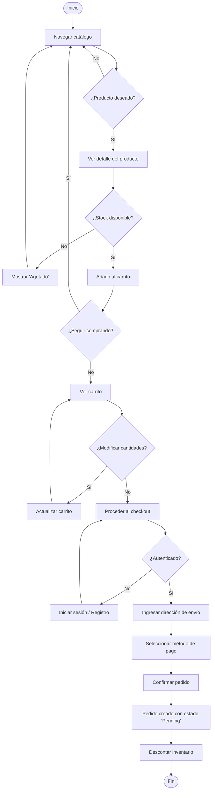
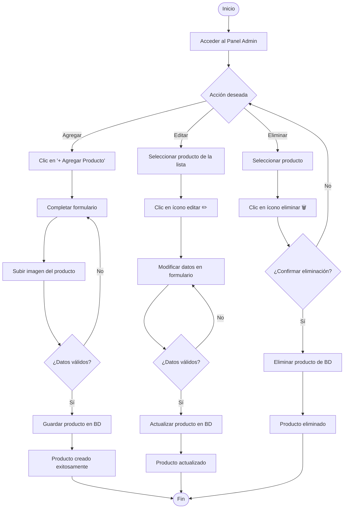
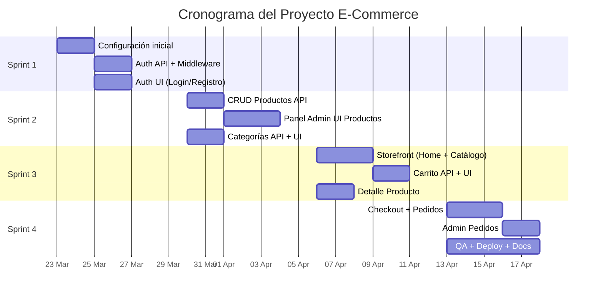

# Documentación de Planificación del Proyecto E-Commerce

## 1. Descripción General

Aplicación de comercio electrónico completa con dos interfaces principales:

| Módulo | Descripción |
|---|---|
| **Panel Administrativo** | Gestión de productos (CRUD), pedidos, clientes y configuración |
| **Tienda del Cliente** | Catálogo de productos, carrito de compras y proceso de compra |

---

## 2. Stack Tecnológico

### 2.1 Frontend

| Tecnología | Uso | Justificación |
|---|---|---|
| **React 18+** | Framework UI | Solicitado por el usuario; ecosistema maduro |
| **Vite** | Build tool / Dev server | Rápido HMR, óptimo para React |
| **React Router v6** | Enrutamiento SPA | Estándar para navegación en React |
| **Axios** | Cliente HTTP | Interceptors, manejo de errores robusto |
| **React Context + useReducer** | Estado global | Suficiente para MVP sin dependencias extra |
| **React Hook Form** | Formularios | Validación eficiente y performante |
| **CSS Modules** | Estilos | Estilos modulares y scoped por componente |
| **React Icons** | Iconografía | Amplia librería de íconos |
| **React Toastify** | Notificaciones | Feedback visual al usuario |

### 2.2 Backend

| Tecnología | Uso | Justificación |
|---|---|---|
| **Node.js 20 LTS** | Runtime del servidor | JavaScript full-stack, non-blocking I/O |
| **Express.js** | Framework HTTP | Ligero, flexible, gran comunidad |
| **Sequelize** | ORM SQL | Modelos, migraciones, validaciones |
| **JSON Web Tokens (JWT)** | Autenticación | Stateless, escalable |
| **bcryptjs** | Hashing de contraseñas | Seguridad estándar de la industria |
| **Multer** | Upload de imágenes | Manejo robusto de archivos |
| **Express Validator** | Validación de inputs | Middleware de validación declarativa |
| **dotenv** | Variables de entorno | Configuración segura |
| **Cors** | Política CORS | Comunicación frontend ↔ backend |

### 2.3 Base de Datos

| Tecnología | Uso |
|---|---|
| **MySQL 8** (desarrollo) | BD relacional principal |
| **MySQL en AWS RDS** (producción) | BD gestionada en la nube |

### 2.4 Infraestructura / Hosting

| Servicio | Uso |
|---|---|
| **Vercel** | Hosting del frontend React (deploy automático con GitHub) |
| **AWS EC2** o **Railway** | Hosting del backend Node.js/Express |
| **AWS RDS** o **PlanetScale** | Base de datos MySQL en la nube |
| **AWS S3** o **Cloudinary** | Almacenamiento de imágenes de productos |
| **GitHub** | Control de versiones y CI/CD |
| **GitHub Actions** | Pipeline de integración continua |

> [!TIP]
> Para un MVP rápido y económico, se recomienda **Vercel** (front) + **Railway** (back + MySQL), ambos con tier gratuito.

---

## 3. Arquitectura del Sistema



### Estructura de la API REST

| Recurso | Método | Endpoint | Descripción |
|---|---|---|---|
| **Auth** | POST | `/api/auth/register` | Registro de usuario |
| | POST | `/api/auth/login` | Inicio de sesión |
| **Productos** | GET | `/api/products` | Listar productos (paginado, búsqueda, filtros) |
| | GET | `/api/products/:id` | Detalle de producto |
| | POST | `/api/products` | Crear producto *(admin)* |
| | PUT | `/api/products/:id` | Editar producto *(admin)* |
| | DELETE | `/api/products/:id` | Eliminar producto *(admin)* |
| **Categorías** | GET | `/api/categories` | Listar categorías |
| | POST | `/api/categories` | Crear categoría *(admin)* |
| **Carrito** | GET | `/api/cart` | Ver carrito del usuario |
| | POST | `/api/cart` | Agregar producto al carrito |
| | PUT | `/api/cart/:itemId` | Actualizar cantidad |
| | DELETE | `/api/cart/:itemId` | Eliminar ítem del carrito |
| **Pedidos** | POST | `/api/orders` | Crear pedido (checkout) |
| | GET | `/api/orders` | Listar pedidos del usuario |
| | GET | `/api/orders/:id` | Detalle de pedido |
| | PATCH | `/api/orders/:id/status` | Cambiar estado *(admin)* |

---

## 4. Modelo Entidad-Relación (MER)



---

## 5. Diagrama de Estados

### 5.1 Estados de un Producto



### 5.2 Estados de un Pedido



---

## 6. Diagramas de Actividades

### 6.1 Flujo de Compra del Cliente



### 6.2 Flujo de Gestión de Productos (Admin)



---

## 7. División de Tareas en Jira

### Epic 1 — Configuración Inicial del Proyecto

| ID | Tipo | Tarea | Estimación |
|---|---|---|---|
| ECOM-1 | Story | Inicializar proyecto React con Vite | 2h |
| ECOM-2 | Story | Inicializar proyecto Node.js/Express | 2h |
| ECOM-3 | Task | Configurar ESLint + Prettier en ambos proyectos | 1h |
| ECOM-4 | Task | Configurar base de datos MySQL y Sequelize | 3h |
| ECOM-5 | Task | Configurar variables de entorno (.env) | 1h |
| ECOM-6 | Task | Configurar repositorio GitHub y ramas | 1h |

### Epic 2 — Autenticación y Autorización

| ID | Tipo | Tarea | Estimación |
|---|---|---|---|
| ECOM-7 | Story | API de registro de usuarios | 4h |
| ECOM-8 | Story | API de login con JWT | 4h |
| ECOM-9 | Task | Middleware de autenticación JWT | 3h |
| ECOM-10 | Task | Middleware de autorización por roles (admin/customer) | 2h |
| ECOM-11 | Story | Pantalla de Login (React) | 4h |
| ECOM-12 | Story | Pantalla de Registro (React) | 4h |
| ECOM-13 | Task | Protección de rutas en el frontend | 3h |

### Epic 3 — Gestión de Productos (Admin)

| ID | Tipo | Tarea | Estimación |
|---|---|---|---|
| ECOM-14 | Story | API CRUD de productos | 6h |
| ECOM-15 | Story | API CRUD de categorías | 3h |
| ECOM-16 | Story | Upload de imágenes con Multer + S3/Cloudinary | 4h |
| ECOM-17 | Story | Panel admin: Listado de productos con paginación | 6h |
| ECOM-18 | Story | Panel admin: Formulario agregar/editar producto | 5h |
| ECOM-19 | Story | Panel admin: Confirmación y eliminación de producto | 3h |
| ECOM-20 | Task | Barra de búsqueda y filtros por categoría/estado | 4h |
| ECOM-21 | Story | Sidebar de navegación del admin | 3h |

### Epic 4 — Tienda del Cliente (Storefront)

| ID | Tipo | Tarea | Estimación |
|---|---|---|---|
| ECOM-22 | Story | Página de inicio con hero banner y productos destacados | 6h |
| ECOM-23 | Story | Catálogo de productos con filtros y búsqueda | 6h |
| ECOM-24 | Story | Página de detalle de producto | 4h |
| ECOM-25 | Story | Header con navegación, búsqueda y carrito | 4h |
| ECOM-26 | Story | Footer con links de categorías, ayuda y legal | 3h |

### Epic 5 — Carrito de Compras

| ID | Tipo | Tarea | Estimación |
|---|---|---|---|
| ECOM-27 | Story | API del carrito (CRUD ítems) | 4h |
| ECOM-28 | Story | Componente carrito de compras (UI) | 5h |
| ECOM-29 | Story | Actualizar cantidades y eliminar ítems | 3h |
| ECOM-30 | Task | Persistencia del carrito en base de datos | 3h |

### Epic 6 — Proceso de Compra (Checkout y Pedidos)

| ID | Tipo | Tarea | Estimación |
|---|---|---|---|
| ECOM-31 | Story | API de creación de pedidos | 5h |
| ECOM-32 | Story | API de listado y detalle de pedidos | 4h |
| ECOM-33 | Story | Pantalla de checkout (dirección + pago) | 6h |
| ECOM-34 | Story | Confirmación de pedido y resumen | 3h |
| ECOM-35 | Story | Historial de pedidos del cliente | 4h |
| ECOM-36 | Story | Admin: Listado de pedidos y cambio de estado | 5h |

### Epic 7 — QA, Deploy y Documentación

| ID | Tipo | Tarea | Estimación |
|---|---|---|---|
| ECOM-37 | Task | Testing unitario de endpoints principales | 6h |
| ECOM-38 | Task | Testing de componentes React (React Testing Library) | 6h |
| ECOM-39 | Task | Configurar deploy frontend en Vercel | 2h |
| ECOM-40 | Task | Configurar deploy backend en Railway/EC2 | 3h |
| ECOM-41 | Task | Configurar BD en producción (RDS/PlanetScale) | 2h |
| ECOM-42 | Task | Documentación de la API (Swagger/Postman) | 4h |
| ECOM-43 | Task | README con instrucciones de setup local | 2h |

---

### Resumen de Estimación

| Epic | Horas estimadas |
|---|---|
| 1. Configuración Inicial | 10h |
| 2. Autenticación | 24h |
| 3. Gestión de Productos (Admin) | 34h |
| 4. Tienda del Cliente | 23h |
| 5. Carrito de Compras | 15h |
| 6. Checkout y Pedidos | 27h |
| 7. QA, Deploy y Docs | 25h |
| **Total** | **~158h** |

> [!IMPORTANT]
> Con un equipo de 2 desarrolladores full-time (~8h/día), el proyecto se estima en **~4 semanas** (1 sprint de 2 semanas para backend + admin, 1 sprint para storefront + checkout + QA).

---

## 8. Cronograma Sugerido (4 Sprints de 1 semana)



---

## 9. Estructura de Carpetas Propuesta

```
E-commerce/
├── frontend/                    # Proyecto React + Vite
│   ├── public/
│   ├── src/
│   │   ├── assets/              # Imágenes, fuentes
│   │   ├── components/          # Componentes reutilizables
│   │   │   ├── common/          # Button, Input, Modal, Sidebar...
│   │   │   ├── admin/           # Componentes del panel admin
│   │   │   └── store/           # Componentes del storefront
│   │   ├── context/             # React Context (Auth, Cart)
│   │   ├── hooks/               # Custom hooks
│   │   ├── pages/               # Páginas/vistas
│   │   │   ├── admin/           # Dashboard, Products, Orders...
│   │   │   └── store/           # Home, Catalog, ProductDetail...
│   │   ├── services/            # Llamadas a la API (axios)
│   │   ├── utils/               # Helpers, constantes, formatters
│   │   ├── App.jsx
│   │   ├── main.jsx
│   │   └── index.css
│   ├── .env
│   ├── package.json
│   └── vite.config.js
│
├── backend/                     # Proyecto Node.js + Express
│   ├── src/
│   │   ├── config/              # DB config, env vars
│   │   ├── controllers/         # Lógica de cada recurso
│   │   ├── middleware/          # Auth, validation, error handler
│   │   ├── models/              # Modelos Sequelize
│   │   ├── routes/              # Definición de rutas
│   │   ├── services/            # Lógica de negocio
│   │   ├── utils/               # Helpers
│   │   └── app.js               # App Express
│   ├── uploads/                 # Imágenes locales (dev)
│   ├── .env
│   ├── package.json
│   └── server.js                # Entry point
│
└── README.md
```

---

## 10. Consideraciones Adicionales

### Seguridad
- Hasheo de contraseñas con **bcryptjs** (salt rounds ≥ 10)
- Tokens JWT con expiración (ej. 24h) y refresh tokens
- Sanitización de inputs con **express-validator**
- Headers de seguridad con **helmet**
- Rate limiting en endpoints de autenticación

### Rendimiento
- Paginación en listados (backend + frontend)
- Lazy loading de imágenes y componentes React (`React.lazy`)
- Optimización de consultas SQL con índices apropiados
- Compresión de respuestas HTTP con **compression**

### UX/UI (basado en las imágenes de referencia)
- Sidebar colapsable en el panel admin
- Badges de estado con color-coding (verde=Activo, rojo=Agotado, amarillo=Bajo Stock, gris=Borrador)
- Formulario de producto en panel lateral (drawer)
- Buscador con filtros por categoría, estado y rango de precio
- Paginación con indicador "Mostrando 1 a 5 de 24 productos"
- Diseño responsive para tienda del cliente
